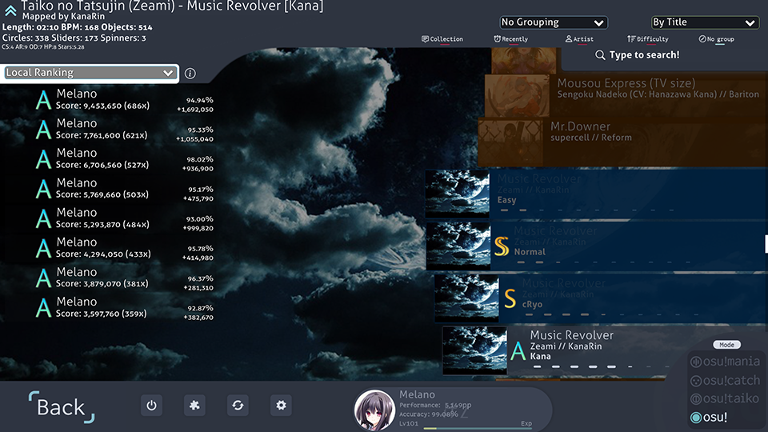
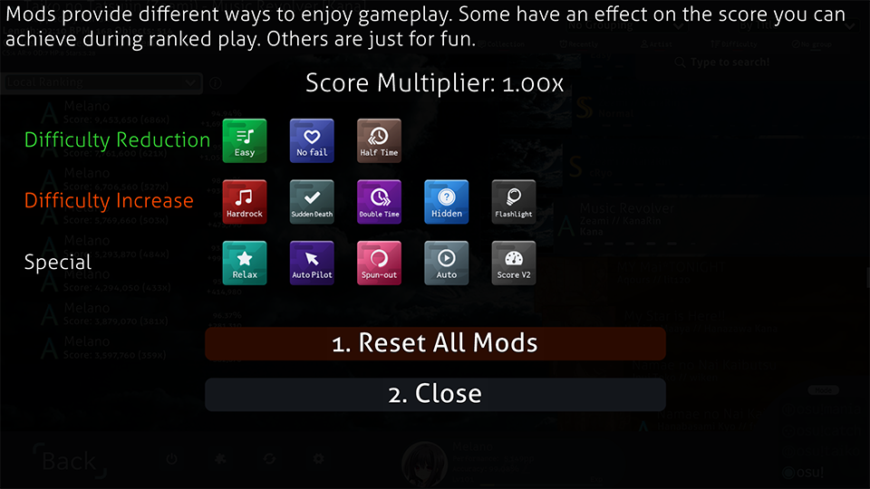
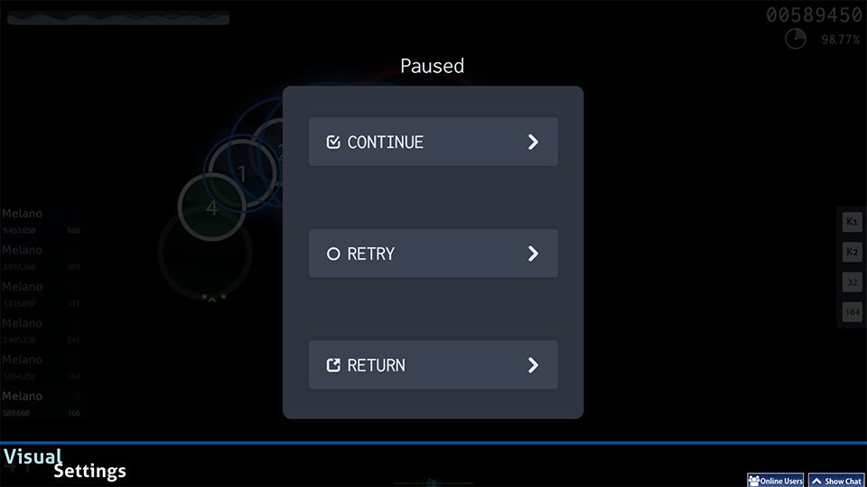
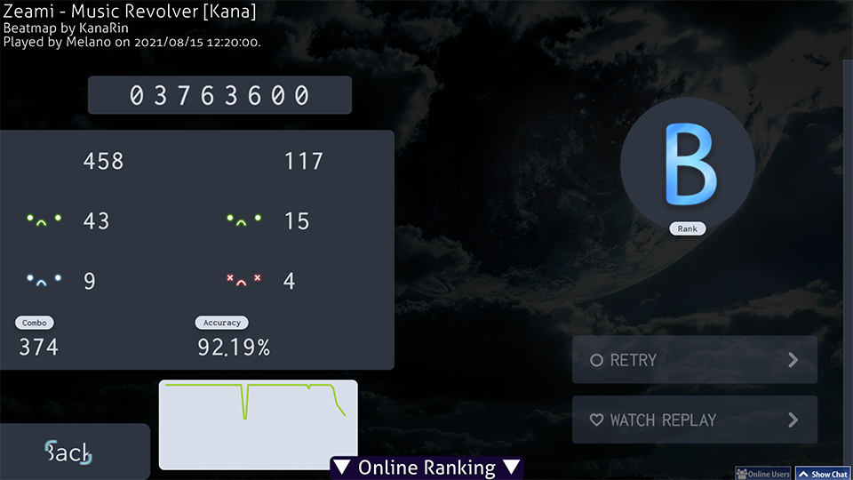
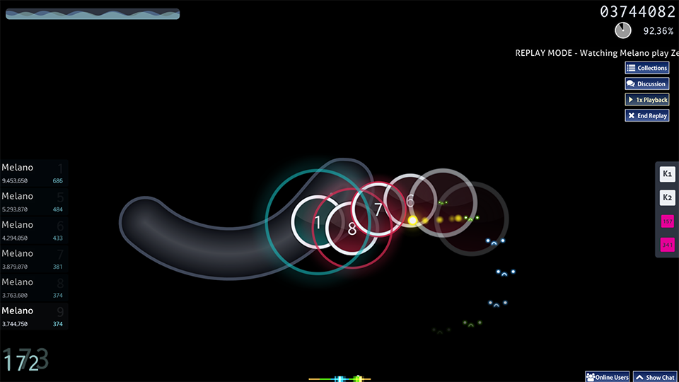
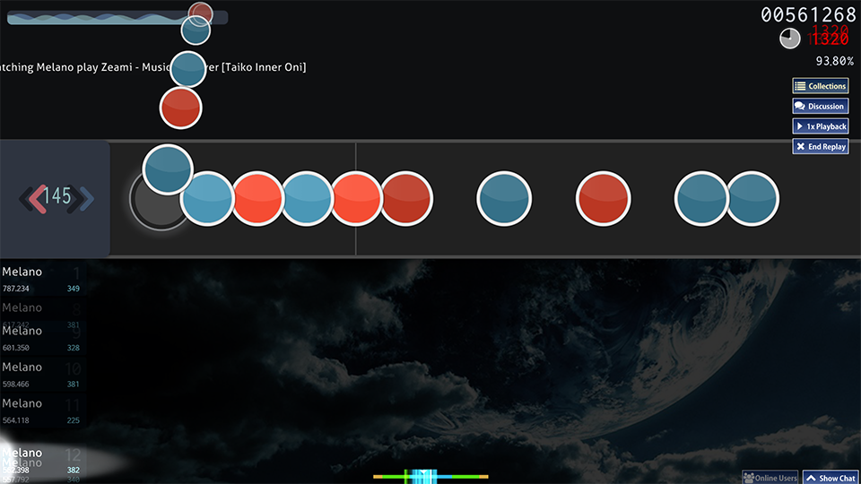

## Preview

  
Song Select

    

  
Mod Icons

    

  
Paused Screen

    

  
Result Screen

    

  
Standard

    

  
Taiko

    

## Install

1. Download the `.osk` from [releases](https://github.com/1b0325h/osu-skin/releases/tag/v2) to anywhere on your computer.
2. Open the file to import the skin to osu!

## Changelog

- v0 - Initial release.
- v1 - The UI is complete with support for the standard.
- v2 - Added support for taiko mode.
